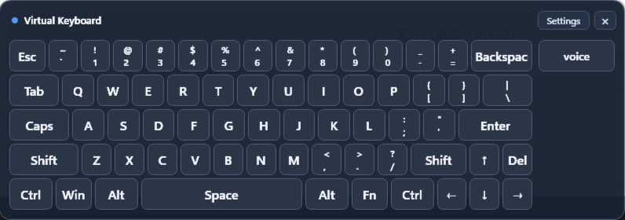

# Virtual Keyboard for Windows

[简体中文](README.zh-CN.md)

Virtual Keyboard is a lightweight floating keyboard for Windows. It appears next to editable fields, stays out of the target application's focus path, and sends input to the field you were already using.



## Highlights

- Opens automatically for supported editable fields and hides outside input scenarios.
- Uses a standard US QWERTY layout with arrows, Windows, Fn, modifier, and editing keys.
- Keeps Shift, Ctrl, Alt, Windows, Fn, and Caps Lock visibly latched until pressed again.
- Supports press-and-hold Backspace with progressively faster deletion.
- Leaves room for IME candidate windows, including third-party Chinese input methods.
- Can be moved and resized from its edges and corners.
- Supports up to 12 custom text or recorded shortcut keys in columns to the right of the keyboard.
- Offers an English or Simplified Chinese interface; English is the default.
- Runs in the notification area and stores settings per Windows user.

## Requirements

- 64-bit Windows 10 or Windows 11.
- [.NET 10 Desktop Runtime](https://dotnet.microsoft.com/download/dotnet/10.0) for the framework-dependent package.
- A normal desktop session. Secure desktop and applications running at a higher integrity level are intentionally not bypassed.

## Install and start

1. Download the latest `VirtualKeyboard-*-win-x64-framework-dependent.zip` and its `.sha256` file from [GitHub Releases](https://github.com/hongguifeng/virtual_keyboard/releases).
2. Optionally verify the SHA-256 checksum.
3. Extract the ZIP to a folder you can write to.
4. Run `VirtualKeyboard.App.exe`.

The application stays in the notification area. Closing the keyboard window only hides it; use **Exit** in the tray menu to quit.

> Current builds are not Authenticode-signed. Windows may show a security warning. Only download releases from this repository and verify the checksum.

## Everyday use

Click a supported editable field and the keyboard appears near it. Click keys normally, or tap Shift, Ctrl, Alt, Windows, or Fn once to hold it and again to release it. Fn maps the number row to F1–F12; it does not emulate a hardware-vendor Fn key.

Drag the title area to move the keyboard. Drag any edge or corner to resize it. Your final size is saved automatically.

The tray menu lets you pause or enable automatic behavior, show the keyboard, open settings, reload layouts, and exit.

## Settings

- **Language** switches the application between English and Simplified Chinese. The settings window updates immediately and the saved choice also applies to the keyboard and tray menu.
- **Show automatically / Hide automatically** control focus-based visibility.
- **Width / Height / Margin** control keyboard size and spacing around the target field.
- **Transparency** ranges from 0% (fully opaque) to 70% (most transparent).
- **Keep dragged position** can retain the position only for the current input field or across input fields.
- **Start with Windows** launches the virtual keyboard at sign-in (current-user startup entry, no administrator required); off by default on first launch.
- **Custom keys** can enter Unicode text or replay a recorded key combination such as `Win+Tab` or `Ctrl+Shift+S`. Press every key in the combination, then release all keys to finish recording.
- **Detailed diagnostics** adds non-sensitive focus metadata to local logs. Input text, passwords, clipboard contents, UI Automation names, and values are never logged.

Settings and logs are stored under `%LocalAppData%\VirtualKeyboard\`. Custom keys are hidden for password fields.

## Known boundaries

- Keyboard injection follows normal Windows permission boundaries. A normally launched keyboard cannot type into an elevated administrator window.
- Secure desktop, UAC prompts, and hardware-specific Fn behavior are not supported.
- Compatibility varies with how an application exposes its editable controls. Please include the application name, Windows version, and reproduction steps in bug reports, but never include passwords or sensitive input.
- The current package is intended for testing until signing and the remaining physical-device compatibility matrix are complete.

See the [user guide](docs/user-guide.md) and [known issues](docs/release/known-issues-1.0.0.md) for more detail.

## Build from source

Install the stable .NET 10 SDK specified by `global.json`, then run from PowerShell:

```powershell
.\scripts\build.ps1
```

The script restores dependencies, builds Release, runs all tests, publishes `win-x64`, and creates a ZIP plus SHA-256 file under `artifacts/`. CI performs build and tests on pushes and pull requests; release packaging runs only for version tags matching `v*`.

Architecture and contributor details are in the [functional specification](Windows%20智能悬浮虚拟键盘软件功能规格说明.md), [design document](Windows%20智能悬浮虚拟键盘方案设计文档.md), [development plan](Windows%20智能悬浮虚拟键盘开发计划%20TODO.md), and [ADR index](docs/adr/README.md).

## Privacy and security

Virtual Keyboard works locally and does not send typing data to a server. Layout and configuration inputs are validated against closed action schemas; arbitrary shell commands and scripts are not supported.
